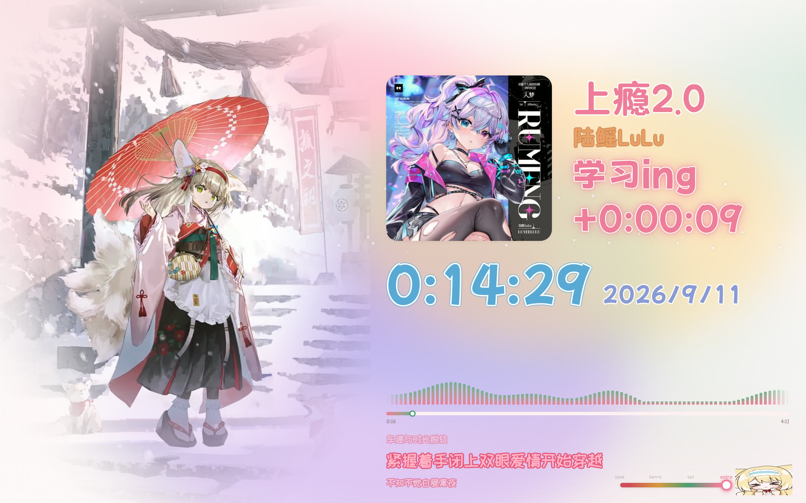

# 铃兰播放器

> 一个樱花粉主题的桌面音乐播放器界面：**实时歌词 + 动态壁纸 + 状态计时器**。
> 读取 Windows 的媒体会话（SMTC），自动识别 QQ 音乐正在播放的歌曲，
> 实时抓取歌词并跟唱，配上《明日方舟》铃兰的动态壁纸与表情。
>
> 建立于 2026-09 · 独立项目（从 DSH 主题实验里拆出来的）



---

## 一句话上手

双击 **`start-player.bat`**，浏览器会自动打开 `http://127.0.0.1:7790/player-ui.html`。
在 QQ 音乐里播放任意歌曲，界面自动跟唱。

关掉那个黑窗口即停止全部服务。

---

## 它长什么样

```
┌────────────────────────┬──────────────────────────────────────┐
│                        │  ┌────────┐  歌名                     │
│                        │  │ 专辑封面 │  歌手                    │
│   铃兰 · 雪霁 动态壁纸   │  └────────┘  学习中  ← 随状态变色发光   │
│   白天 / 夜晚随主题切换   │              +0:00:08                │
│   雪花飘落              │                                      │
│                        │  18:41:18   2026/9/10                │
│                        │  ▁▃▅▇▅▃▁▃▅▇  ← 律动频谱（跟播放状态）   │
│                        │  ▬▬▬▬▬▬▬●─────────  ← 渐变进度条       │
│                        │  2:31                     3:35       │
│                        │  上一句歌词（淡）                     │
│                        │  当前歌词（大字花字）                  │
│                        │  下一句歌词（淡）                     │
│                        │                             [铃兰表情] │
└────────────────────────┴──────────────────────────────────────┘
```

---

## 功能

### 实时歌词
- 三行显示：上一句 / 当前句 / 下一句
- 当前句用**花字效果**（浅粉字面 + 深粉描边），上下句压暗
- 自动跳过开头的"作词/作曲/编曲"字幕段，前奏期间显示"前奏中"
- 歌名过长自动缩字号（二分查找，6 次试探定出合适字号）

### 状态计时器
- **四档状态滑块**（右下角，铃兰左边），强度从左到右递增：

  | 档位 | 状态 | 颜色 |
  |---|---|---|
  | luna | 睡觉 | 红 |
  | terra | 外出 | 琥珀 |
  | sol | 娱乐 | 绿 |
  | astra | 学习 | 粉 |

- 可以左右**拖动**滑块，也能点轨道任意位置跳档；方向键也支持
- 打开页面即自动开始计时，切档归零重计
- 文案用「…ing」（学习ing / 娱乐ing …）
- 大钟区独立显示**系统时间**与**日期**
- 状态与计时有**发光描边**（内圈细描边 + 外层柔光），光色跟着档位走

### 视觉
- 左侧**动态壁纸**：铃兰雪霁「昼夜更替」，白天/夜晚两版交叉淡入
- **壁纸竖椭圆遮罩**：短半轴 = 竖带宽 × 0.6，长半轴 = 卡高 × 0.6，
  以铃兰为中心向外淡出，和背景融合（没有方形边界）
- **昼夜跟随主题**：浅色主题用白天版，深色用夜晚版
- **主题切换扩散动画**：5 秒，新主题从滑块位置向外推开旧画面
- **右下角铃兰表情**：点它切明暗；随音乐抖动，舒展时睁眼、压缩时闭眼
- **律动频谱**：时钟下方，跟随播放状态起伏（**拟态**，非真频谱）
- **渐变进度条**：粉 → 薄荷绿
- **背景动效**：网格渐变色团游走 + 落雪飘落，铺满整卡，固定开启
- 全局配色分四色系（大钟天蓝 / 日期紫 / 歌名粉 / 歌手橙），避免同色视觉疲劳

### 字体（三套分工）

| 用途 | 字体 | 授权 |
|---|---|---|
| 歌名 / 歌手 | 黑糖话梅 | SIL OFL |
| 状态 / 计时 / 时间日期 | 荆南波波黑 | SIL OFL |
| 歌词 | 站酷快乐体 | SIL OFL |
| 界面默认（档位提示等） | 荆南麦圆体 | SIL OFL |

### 设置

**没有设置面板**。唯一需要配的是明暗主题 —— **点右下角铃兰即可切换**，
带 5 秒的扩散过渡动画。

（历史上做过设置面板、素柔满装饰强度、背景动效开关、开始/暂停按钮，
后来都移除了。详见 `docs/交接文档.md` 的"已移除"一节。）

---

## 目录结构

```
suzuran-player/
├─ start-player.bat          双击入口
├─ player-ui.html            界面（由 src/build-player-ui.mjs 生成，别手改）
├─ bg-lab.html               背景动效样张
│
├─ src/                      构建与工具
│   ├─ build-player-ui.mjs   ★ 界面的唯一源文件，改界面改这里
│   ├─ palettes.mjs          主题色板（从 DSH 樱花麻薯主题来）
│   ├─ timer.mjs             计时器核心逻辑（纯逻辑，可测）
│   ├─ timer-inline.mjs      把 timer.mjs 内联进页面的包装
│   ├─ timer.test.mjs        计时器单元测试（40 项）
│   ├─ serve.mjs             静态服务 + /api 反向代理
│   ├─ launcher.ps1          启动脚本（起两个服务 + 开浏览器）
│   ├─ make-shortcut.ps1     生成桌面快捷方式
│   └─ tools/                工具脚本，按用途分组
│       ├─ lib/              公共库（cdp-shot 安全截图等）
│       ├─ shots/            截图与视觉验证
│       ├─ checks/           断言 / 测量 / 排查（smoke.mjs 在这）
│       ├─ labs/             样张页生成
│       └─ assets/           素材处理（壁纸导出、字体信息）
│
├─ overlay/                  歌词服务（读 SMTC + 抓歌词）
│   ├─ src/
│   │   ├─ server.mjs        HTTP + SSE 服务
│   │   ├─ track-reader.mjs  常驻会话读取（读 PowerShell 监视器的输出流）
│   │   ├─ lyrics.mjs        ★ 搜歌 + 取歌词 + 匹配策略
│   │   ├─ live.mjs          浏览器端数据层（快照 + 补间 + 歌词分行）
│   │   └─ build-overlay.mjs 歌词浮层页（另一种展示形态）
│   └─ tools/
│       ├─ session-watch.ps1 常驻 SMTC 监视器（PowerShell）
│       └─ probe-*.mjs       接口可用性 / 限流诊断
│
├─ assets/
│   ├─ wallpaper/            昼夜两版壁纸 + 海报帧
│   ├─ character/expressions/ 铃兰表情（open.gif / closed.gif）
│   └─ fonts/
│       ├─ theme/            界面在用的（荆南麦圆体）
│       ├─ cute/             候选可爱字体（8 款，含 meta.json）
│       └─ pickers/          更早一批候选（圆体系）
│
└─ docs/
    ├─ 交接文档.md           ★ 先读这个
    ├─ 架构与技术决策.md      为什么这么写
    ├─ 已知问题与限制.md      踩过的坑 + 改不掉的限制
    ├─ 素材来源与授权.md      发布前必看
    └─ shots/               验证截图
```

---

## 常用命令

```powershell
# 改完界面后重新生成
node src\build-player-ui.mjs

# 改完必跑：冒烟测试（44 项）
node src\tools\checks\smoke.mjs

# 启动（会自动清理占用的端口）
.\start-player.bat

# 只起服务不开浏览器
powershell -File src\launcher.ps1 -NoBrowser

# 重建桌面快捷方式
powershell -File src\make-shortcut.ps1

# 计时器单元测试（40 项，假时钟驱动，不用真等）
node src\timer.test.mjs

# 截当前界面 + 打印实时状态
node src\tools\shots\verify-live-ui.mjs docs\shots\check.png

# 量各元素实际字号
node src\tools\checks\measure-ui.mjs

# 排查歌词接口（哪个还能用）
node overlay\tools\probe-apis.mjs

# 看当前状态 / 搜索诊断
curl http://127.0.0.1:7788/api/state
curl http://127.0.0.1:7788/api/diagnostics

# 样张页
node src\tools\labs\build-bg-lab.mjs         # 背景动效
node src\tools\labs\build-cute-font-lab.mjs  # 可爱字体
```

### 调试开关

```js
// src/build-player-ui.mjs
const SHOW_HERO = true    // 改 false 隐藏铃兰壁纸，单独看界面
const DUR = 5000 * SLOW   // 过渡时长；加 ?slow=4 放慢 4 倍
```

---

## 界面是怎么生成的

`player-ui.html` 是**构建产物**，不要直接改它——改 `src/build-player-ui.mjs` 然后重新构建。

构建脚本做的事：
1. 把 `palettes.mjs` 的主题色板、各种描边/发光配置**算成 CSS 字符串**塞进页面
2. 把 `timer.mjs` 和 `overlay/src/live.mjs` 两个 ES module **剥掉 export 关键字内联进 `<script>`**
3. 输出到项目根目录

之所以要"构建时算好"，是因为页面里的内联脚本没有模块上下文，跑不了函数。

---

## 授权

### 代码 —— MIT
本项目代码以 **MIT** 发布（见 `LICENSE`），可自由使用、修改、分发、商用。

### 素材 —— 不属于 MIT，著作权归原作者

| 素材 | 作者 / 来源 | 说明 |
|---|---|---|
| 铃兰壁纸（昼夜两版） | **Eloncy** · Wallpaper Engine 创意工坊「[明日方舟] 铃兰 雪霁 - 昼夜更替」 | 二创作品，商用请先联系作者 |
| 铃兰表情（睁眼/闭眼） | **妖梦owo** · 铃兰表情包 | 商用请先联系作者 |
| 黑糖话梅 / 站酷快乐体 | 开源字体 | ✓ SIL OFL 1.1，可商用 |
| 荆南波波黑 / 荆南麦圆体 | 开源字体 | ✓ SIL OFL 1.1，可商用 |
| 樱花麻薯配色 | 自制 | ✓ 自由使用 |

**感谢 Eloncy 和 妖梦owo 的创作。**
这两份素材出于个人使用与学习目的引用，已在文档中标注作者来源。

授权范围详见 `LICENSE-SCOPE.md`，来源追溯详见 `docs/素材来源与授权.md`。

---

## 已知限制

- **律动频谱是拟态**：拿不到 QQ 音乐的音频流（声音不经过浏览器），
  现在的起伏是多组正弦叠加模拟的。要做真的得用 WASAPI 环回采集 + FFT
- **进度是推算的**：QQ 音乐不通过 SMTC 上报播放位置（恒为 0），
  位置靠"开始播放时刻 + 单调时钟"算。拖动进度条后会偏
- **封面来自搜索接口**：SMTC 的缩略图对 QQ 音乐是空流（`size=0`），
  改从搜索接口的 `album.mid` 拼封面 URL
- **歌词接口会限流**：频繁切歌触发 `code=2001`，约 1 分钟冷却。
  已做请求闸门（3 秒间隔）+ 失败自动补取
- **QQ 音乐不报时长**，时长来自搜索接口的 `interval` 或歌词末行估算
- **只支持 QQ 音乐**：会话读取能换 `-App`，但歌词源和封面源都是 QQ 音乐的

完整的坑与限制见 `docs/已知问题与限制.md`。
